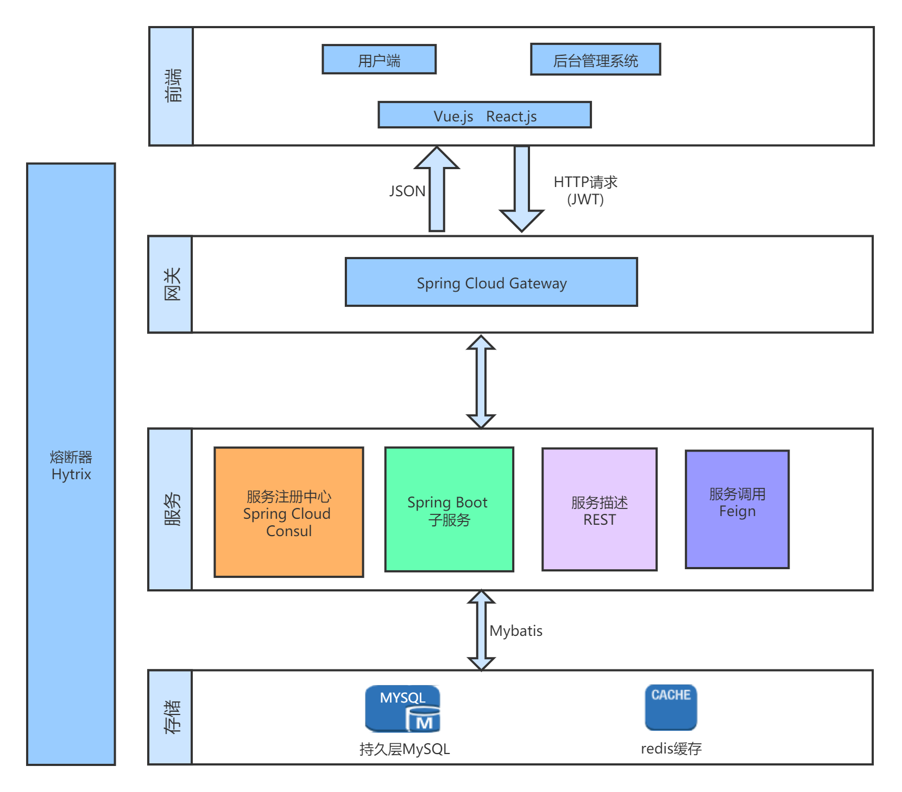
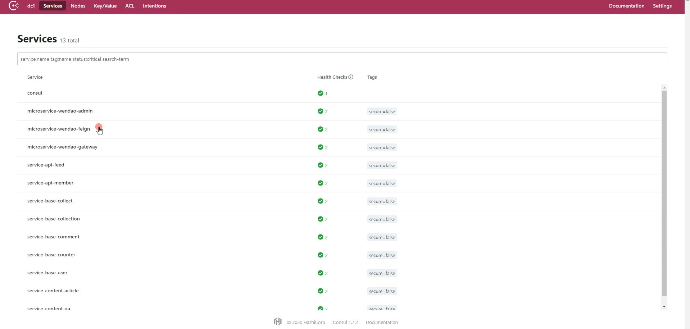
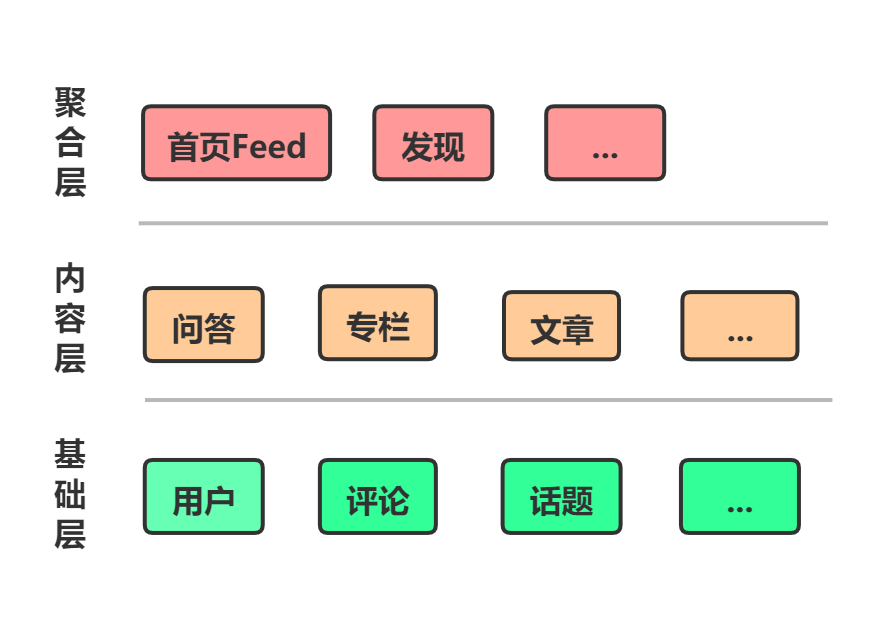

> 本系统为问道问答系统的后端管理系统的服务端采用Spring Cloud的技术栈。
>
> 1. Consul---服务注册中心
> 2. Spring Cloud OpenFeign---服务调用
> 3. Spring Cloud Hytrix---熔断器
> 4. Spring Cloud Gateway---网关

- 微服务架构图

  

- 注册中心截图

  

- 按照服务模块进行划分

  